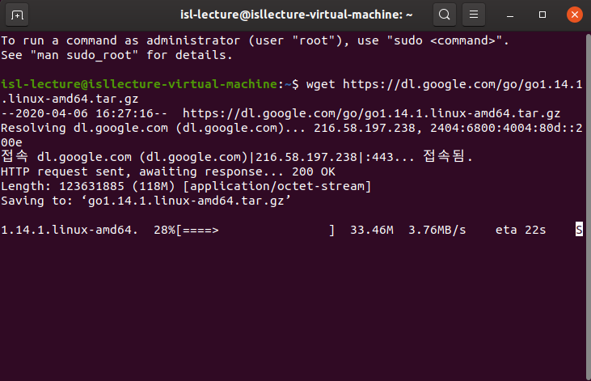
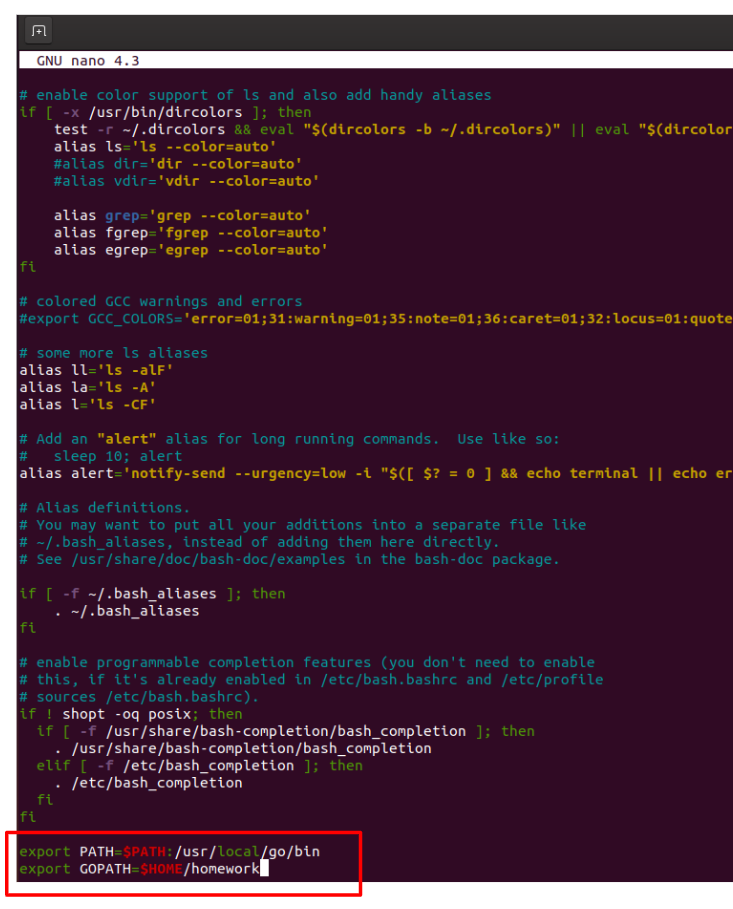
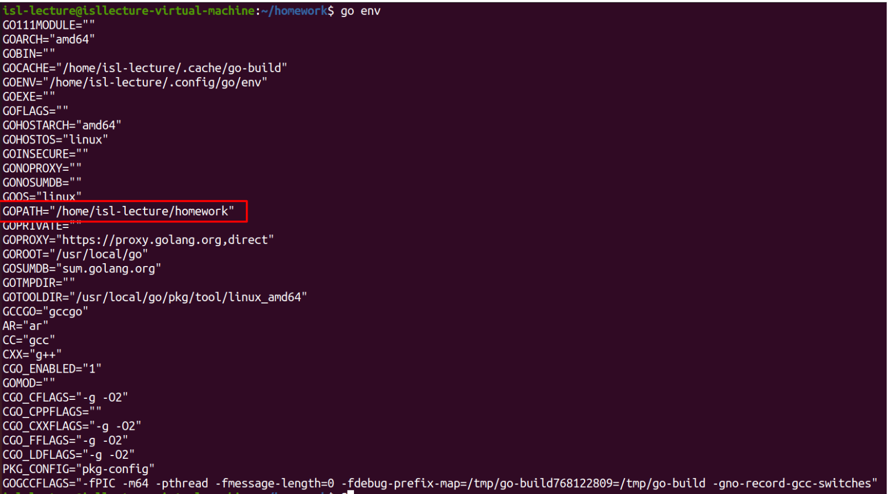

# Go 언어 환경설정

## Windows


## Ubuntu
### golang 설치



```bash
wget https://dl.google.com/go/go1.14.1.linux-amd64.tar.gz
tar -xvf go1.14.1.linux-amd64.tar.gz
sudo mv go /usr/local/
```

## 경로 설정

### 프로젝트를 위한 디렉터리 생성

```bash
mkdir ~/homework
```

### 바이너리 파일 및 GOPATH경로 설정

```bash
nano ~/.bashrc
```



```bash
export PATH=$PATH:/usr/local/go/bin
export GOPATH=$HOME/homework
```

- `Ctrl + X` => `Y` => `Enter` 를 통해 파일 저장 후 나가기

- Terminal 재시작 후 go env를 통해 gopath가 제대로 설정되었는지를 확인함

  

## Mac

# Ref